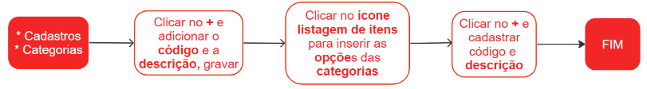

# Categorias

Categoria é um termo genérico que se refere a um grupo ou conjunto de coisas ou ideias que possuem características em comum. Em diferentes contextos, a categorização é utilizada para organizar e classificar informações, produtos, pessoas ou ideias de acordo com diferentes critérios.

Ao cadastrar uma nova categoria, é importante verificar se já existe alguma categoria semelhante para evitar duplicações e manter a organização do sistema. Em caso de dúvidas, é recomendável buscar referências em cadastros existentes para garantir a padronização.

## Cadastro de uma Categoria

