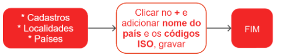

# Países

Um país é uma referência a uma nação ou Estado soberano, que possui um território definido, um governo e uma população com identidade e cultura próprias. É composto por estados e cidades que formam sua organização política e administrativa.

Para esclarecer dúvidas durante o cadastro, é recomendável buscar referência em cadastros existentes.

## Cadastro de um País

