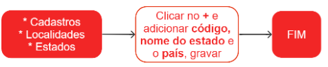

# Estados

Um Estado é uma organização política que exerce autoridade sobre um território definido, com um governo centralizado que detém o monopólio do uso legítimo da força. Ele é composto por inúmeras cidades, que formam sua organização administrativa.

Para esclarecer dúvidas durante o cadastro, é recomendável buscar referência em cadastros existentes.

## Cadastro de um Estado

