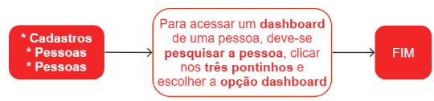

# Dashboard de pessoas

Dashboard é um painel de controle que, no contexto da tecnologia da informação, é uma interface gráfica de usuário que apresenta informações em tempo real de forma visual e fácil de entender. Os dashboards são amplamente utilizados para monitorar e gerenciar dados de negócios, tais como desempenho de vendas, valores a pagar e a receber, entre outros. Eles podem ser personalizados para exibir gráficos, tabelas, mapas, indicadores de desempenho-chave (KPIs) e outros elementos visuais que ajudam os usuários a entender rapidamente a situação atual e tomar decisões baseadas nessas informações.

O dashboard de pessoas, por sua vez, exibe um resumo consolidado das informações comerciais e financeiras de uma pessoa, tais como dados de vendas, pagamentos pendentes, histórico de transações e outras informações relevantes.

## Como acessar um dashboard

