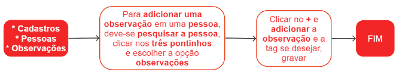

# Observações

Este submódulo é responsável por registrar observações relevantes sobre um cliente, possibilitando a inclusão de várias observações para uma mesma pessoa.

## Cadastro de uma observação

