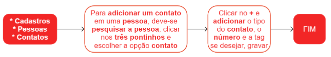

# Contatos

Contato é o termo utilizado para se referir a uma pessoa, empresa ou instituição com a qual uma pessoa ou organização mantém conexão ou relacionamento. É possível incluir vários contatos para uma mesma pessoa e, dentro de cada um deles, adicionar diversas informações como e-mail, telefone, site e outras informações relevantes.

Para facilitar a identificação dos contatos, é recomendável utilizar tags especiais. Alguns exemplos são:

* #default: indica o e-mail padrão cadastrado para a pessoa.
* #cellphone: indica que o número cadastrado é de um celular.
* #billing: indica que o e-mail cadastrado é para uso de cobrança, sendo utilizado pelo sistema para o envio automático de boletos.
* #nfe: indica que o e-mail cadastrado é para uso de faturamento, sendo utilizado pelo sistema para o envio automático de xml e DANFe.

## Cadastro de um contato

