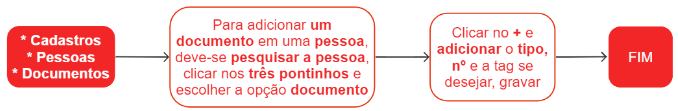

# Documentos

Documento é qualquer registro escrito, impresso ou digital que contenha informações ou dados de alguma forma. É possível incluir vários documentos para uma pessoa, selecionando a opção desejada a partir de uma lista de opções. Caso a opção desejada não esteja disponível, é possível selecionar a opção "outros" e inserir o número do documento.

Se for necessário adicionar o documento em formato de arquivo, é possível selecionar a opção "arquivo" dentro do perfil da pessoa correspondente.

## Cadastro de um documento

