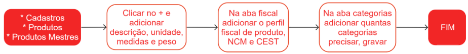

# Produtos mestres

O termo **produto mestre** refere-se à menor unidade comercializável de um produto, que pode variar de acordo com a forma como é comercializado. Por exemplo:

1. Se um produto é vendido em caixas com 12 unidades, o **produto mestre** representa uma única unidade desse produto;
1. Se um produto é vendido em unidades com tamanhos P, M ou G, o **produto mestre** representa uma única unidade desse produto, independentemente do tamanho;
1. Se um produto é vendido em metros, com opções de cores azul, amarelo ou vermelho, o **produto mestre** representa um metro desse produto, independentemente da cor escolhida.

## Pontos relevantes

1. O código do produto mestre segue um padrão. Caso o campo de código esteja vazio, o sistema atribuirá automaticamente o **id** como código do produto mestre.
1. A **descrição** do produto será exibida nos documentos fiscais.
1. As **palavras-chave** são utilizadas para facilitar a busca do produto no sistema, tornando a pesquisa mais eficiente.
1. A unidade representa a menor fração comercializável do produto.
1. Cadastre o código de barras no formato GTIN8, GTIN13 ou GTIN14.

## Cadastro de um produto mestre

## Menu adicional

Para acessar mais informações de um produto, clique em {.icon}