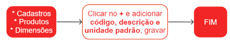

# Dimensões

O termo **dimensão** é utilizado para descrever uma medida ou propriedade de um objeto, podendo ser física ou abstrata. As dimensões físicas incluem o comprimento, largura e altura de um objeto, enquanto as dimensões abstratas incluem o tempo, qualidade e complexidade, entre outros aspectos que não são tangíveis ou mensuráveis de maneira direta.

## Cadastro de uma dimensão

