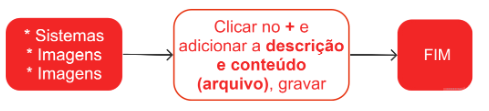

# Imagens

Uma imagem é uma representação visual de um objeto, cena, ideia ou conceito, criada através de meios como fotografia, pintura, desenho, gráficos digitais, entre outros. As imagens tem como objetivo comunicar ou transmitir uma mensagem visual.

## Anexar imagens no Produto Mestre

## Anexar imagens no ZEN

<!--  -->