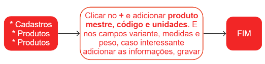

# Produtos

Um produto representa uma embalagem comercial ou uma variação do [produto mestre](product).

## Pontos Relevantes

1. Ao inserir o código do produto, é importante verificar se a padronização adotada está sendo seguida para que todos os itens sejam cadastrados conforme o estabelecido. 
1. A variante do produto representa uma variação que pode incluir o tamanho, cor e outros quesitos que diferem do produto mestre.
1. No campo **unidade**, é necessário informar a quantidade de unidades do produto mestre que o produto cadastrado possui. Para isso, segue abaixo alguns exemplos:

* Se o produto é uma embalagem de caixa com 12 unidades do produto mestre, informe 12 para a unidade.
* Se o produto é um tecido vendido em metros ou quilos, informe 1 para a unidade.
* Se o produto é uma variação de tamanho do produto mestre, informe 1 para a unidade.

Dessa forma, o cadastro dos produtos estará em conformidade com as especificações e permitirá um controle mais preciso do estoque e vendas.

## Cadastro de um produto

## Menu adicional

Para acessar mais informações de um produto, clique em {.icon} e selecione a opção desejada.
