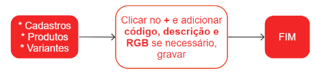

# Variantes

Uma variante de produto é uma versão específica de um produto que representa uma variação ou uma característica que diferencia um produto de outro. Essa variação pode ser relacionada a diferentes aspectos, como tamanho, cor, material, entre outros.

As variantes de produto são importantes para atender às necessidades e preferências dos clientes, além de permitir uma oferta mais diversificada e personalizada.

Além disso, as variantes de produto também são úteis para fins de controle de estoque e gestão de produção. Com elas, é possível diferenciar e gerenciar diferentes versões do mesmo produto de forma mais eficiente.

## Cadastro de uma variante

## Pontos relevantes

1. Se a variante for uma cor, informe o código hexadecimal correspondente no formato #FFFFFF (RGB).
Você pode converter uma cor RGB para o formato hexadecimal utilizando o site [rgbtohex](https://www.rgbtohex.net/).
1. No campo **código**, insira o código da variante.
     Exemplo 1: PP, P, M, G, GG.
     Exemplo 2: 001, 002, 003.
     Exemplo 3: 100C, 100U, 2088C.
1. No campo **descrição** forneça a descrição da variante.
     Exemplo 1: Off-white, Branco, Preto.
     Exemplo 2: Amarelo, Amarelo claro, Rosa.