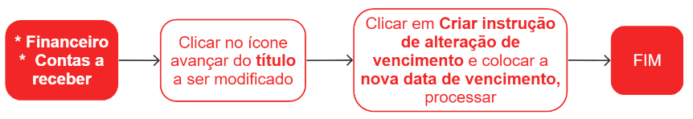

# Instruções de cobrança

A instrução de cobrança é um documento que contém informações detalhadas sobre um título a ser cobrado, como boletos bancários, faturas, duplicatas, entre outros. Ela é utilizada para orientar a instituição financeira ou empresa responsável pela cobrança sobre como deve ser feita a cobrança desse título.

A instrução de cobrança pode conter informações como o valor a ser cobrado, a data de vencimento, o nome do devedor, a forma de pagamento, os juros e multas em caso de atraso, entre outras informações relevantes para a cobrança do título.

## Pontos relevantes

1. Todo título que possuir a tag **#instruction** indica que uma instrução foi aplicada.

## Cadastro de uma instrução de alteração de vencimento no banco

## Alteração de vencimento no sistema

## Cadastro de uma instrução de baixa de carteira

<!--  -->