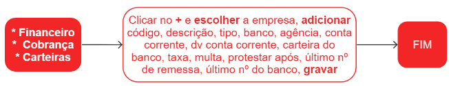

# Carteiras cobrança

Uma carteira de cobrança é um conjunto de títulos (duplicatas, boletos, faturas, entre outros) que precisam ser cobrados por uma empresa ou instituição financeira. Essa carteira geralmente é gerenciada por um sistema que controla o status de cada título, como a data de vencimento, se já foi pago ou não, se está em atraso e qual o valor devido.

A carteira de cobrança é importante para empresas que vendem a prazo ou prestam serviços e precisam receber pagamentos dos clientes. Através dela, é possível controlar as contas a receber e tomar ações para evitar a inadimplência, como o envio de lembretes de pagamento, negociação de prazos e até mesmo a inclusão do devedor em cadastros de restrição ao crédito.

Para esclarecer eventuais dúvidas, utilize um cadastro já existente como modelo de referência.  

## Cadastro de uma carteira de cobrança

