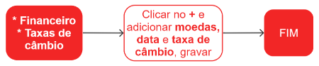

# Taxas de câmbio

Taxa de câmbio é o preço de uma moeda em relação a outra moeda. É o valor que uma determinada moeda tem em relação a outra, e é expressa em um par de moedas, por exemplo, o dólar americano em relação ao euro. A taxa de câmbio é um importante indicador econômico, pois afeta o comércio internacional, a inflação e o fluxo de investimentos entre países. 

A taxa de câmbio pode ser fixa ou flutuante, dependendo da política monetária adotada pelo país emissor da moeda. As taxas de câmbio podem ser afetadas por diversos fatores, como a política monetária, a inflação, a balança comercial e as expectativas do mercado.

Neste submódulo, será feito o cadastro das taxas de câmbio utilizadas para compra e venda de mercadorias.

## Cadastro de uma taxa de câmbio

