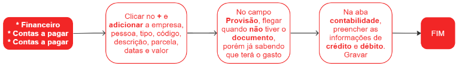

# Contas a pagar

As contas a pagar são despesas que uma empresa deve pagar a terceiros dentro de um prazo determinado. Essas despesas podem englobar pagamentos a fornecedores, aluguel, salários, impostos e outros custos operacionais essenciais para o funcionamento do negócio.

Essas contas podem ser geradas automaticamente pelo processo de entrada de notas fiscais ou incluídas manualmente, sem vínculo com uma nota fiscal específica.

## Pontos relevantes:

1. As linhas identificadas com a tag **#system** foram inseridas automaticamente e não poderão ser alteradas e terão o status de aprovado. Já as linhas com a tag **#manual** foram inseridas manualmente e podem ser alteradas ou excluídas conforme necessário.
1. Quando uma conta a pagar é gerada manualmente, seu status inicial é definido como **preparando**. Para que o documento seja aprovado, é necessário seguir os procedimentos estabelecidos pela empresa e, em seguida, aprovar essa conta no sistema para que o processo possa avançar.
1. Para contas de crédito, como fornecedores e outros passivos, é utilizado um número de conta iniciado por 2. Já para contas de débito, como despesas e resultados, o número de conta é iniciado por 4.
1. Reversões de pagamento podem ser realizadas apenas quando o status do pagamento não está como LIQUIDADO.

## Cadastro de uma conta a pagar manualmente

