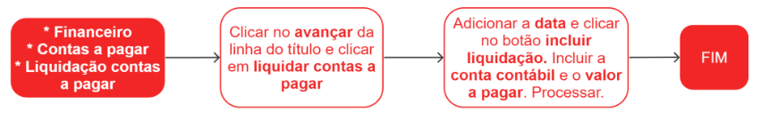
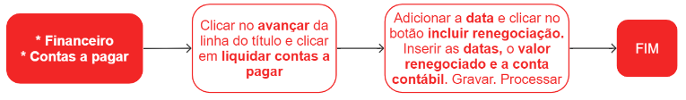
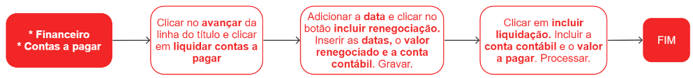

# Liquidação de contas a pagar

A liquidação de contas a pagar é um processo pelo qual uma empresa realiza o pagamento total ou parcial de uma dívida que um fornecedor ou outra empresa que ela deve. Em outras palavras, é o momento em que o pagamento é feito e a dívida é quitada.

## Pontos relevantes:

1. O sistema preenche automaticamente com o valor em aberto. Para liquidação parcial, informe o valor que deseja liquidar. A diferença ficará em aberto como saldo do documento;

1. Os campos de desconto, juros e multa devem ser preenchidos somente se necessário e farão parte do valor total do movimento;

1. A conta contábil preenchida indica o destino do recurso, por exemplo, a conta contábil do banco em que o recurso foi debitado;

1. Uma liquidação pode estar associada a mais de uma conta contábil. O único requisito é que a soma dos lançamentos contábeis confiram com o valor da despesa. E para dividir o lançamento em mais de uma conta contábil clique em **Incluir liquidação** novamente e preencha os campos.

## Incluir liquidação

## Incluir renegociação 

A renegociação financeira é um processo no qual uma empresa busca modificar os termos de um acordo financeiro existente, geralmente com o objetivo de prorrogar o prazo de pagamento, acrescentar valor de juros e multa, efetuar pagamento de um montante e estender o prazo para quitar o restante.

Para adicionar mais de uma transação, clique novamente em **Incluir renegociação** e repita o procedimento até que todas as transações necessárias tenham sido registradas.

## Incluir uma renegociação com liquidação

