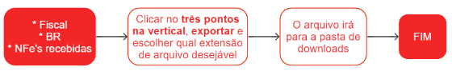

# Exportar NFe's recebidas

Para exportar Notas Fiscais Eletrônica (NFe) recebidas com o objetivo de realizar uma conferência, imprimir uma segunda via ou encaminhar a carga mensal à contabilidade, siga as seguintes etapas:

