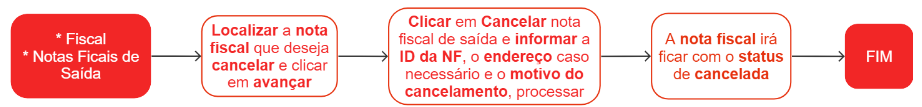
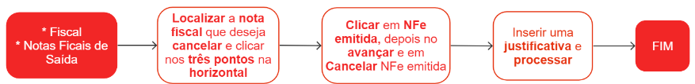
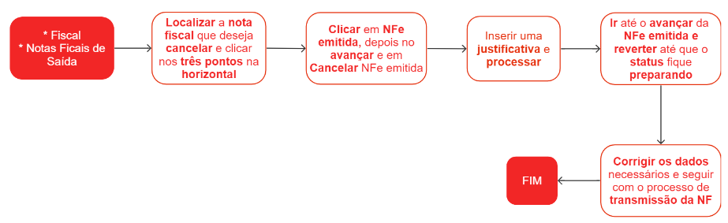

# Cancelamento de nota fiscal

Uma nota fiscal transmitida ao SEFAZ pode ser cancelada em determinadas situações, seguindo as regras estabelecidas pela legislação fiscal. As possibilidades de cancelamento de uma nota fiscal podem variar de acordo com a legislação específica de cada país ou estado. De forma geral, o prazo padrão para o cancelamento é de 24 horas após a autorização da nota fiscal pelo SEFAZ.

Em geral, algumas das circunstâncias em que é possível solicitar o cancelamento de uma nota fiscal transmitida ao SEFAZ incluem:

1. Erros na emissão: Caso haja erros nos dados da nota fiscal, como valores incorretos, descrição de produtos ou serviços equivocada, informações de destinatário errôneas, entre outros, é possível solicitar o cancelamento para corrigir as informações;
1. Desistência da operação: Se a venda de produtos ou a prestação de serviços não for concluída por qualquer motivo, é permitido o cancelamento da nota fiscal;
1. Devolução de mercadorias ou anulação de serviços: Quando ocorre a devolução de mercadorias ou a anulação de serviços após a emissão da nota fiscal, é possível solicitar o cancelamento para refletir essa operação;

## Cancelar a nota fiscal de saída no ZEN ERP

## Cancelar a nota fiscal de saída no Sefaz

## Cancelar a nota fiscal no SEFAZ para transmitir novamente

Caso necessite apenas cancelar a nota no SEFAZ devido algum erro, mas a nota será transmitida novamente após correção, siga os passos abaixo. Mas se o erro for no pedido de venda (produto, quantidade ou valor), será necessário cancelar todo o processo e incluir um novo pedido de venda.

