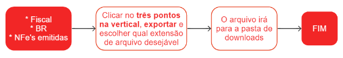

# Exportar NFe's emitidas

Para exportar Notas Fiscais Eletrônica (NFe) emitidas com o objetivo de realizar uma conferência, enviar uma segunda via ao cliente ou encaminhar a carga mensal à contabilidade, siga as seguintes etapas:

