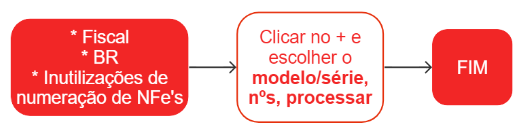

# Inutilização de numeração de NFe's

A inutilização de numeração de NFe's é um procedimento realizado pelas empresas para informar à Secretaria da Fazenda do Estado (SEFAZ) que determinada numeração de NFe não será mais utilizada. Isso pode ocorrer, por exemplo, quando há um erro na sequência numérica de uma NFe, quando a NFe é cancelada antes da sua emissão ou em outras situações específicas previstas na legislação.

Esse processo deve ser realizado por meio do sistema de emissão de NFe, informando o intervalo de numeração que será inutilizado e o motivo da inutilização. Após a transmissão dessa informação, a SEFAZ verifica se as condições para a inutilização foram atendidas e emite um protocolo de inutilização, que deve ser armazenado pela empresa juntamente com os demais documentos fiscais.

A inutilização de numeração é importante para manter a sequência numérica das NFe's emitidas pela empresa em conformidade com a legislação fiscal e para evitar fraudes e inconsistências nas informações fiscais. É importante que a empresa realize a inutilização de numeração sempre que necessário e siga corretamente os procedimentos estabelecidos pela SEFAZ.

## Como inutilizar um número de NFe

Para identificar quais numerações foram puladas, acesse o relatório