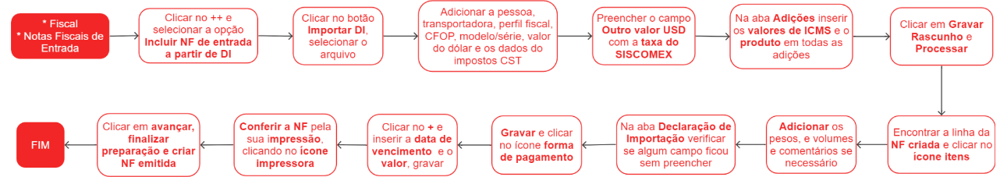

# Criar nota fiscal de entrada à partir de uma DI

A Declaração de Importação (DI) é um documento eletrônico obrigatório que contém informações essenciais sobre a importação de mercadorias para o Brasil. Ela é apresentada antes da entrada das mercadorias no país e inclui detalhes sobre a origem, valor, classificação fiscal e outros dados relevantes para a fiscalização aduaneira. A DI é processada pelo Sistema Integrado de Comércio Exterior (Siscomex), utilizado pelo governo brasileiro para gerenciar o comércio exterior. Além disso, a DI é crucial para a cobrança de impostos e taxas aduaneiras, como o Imposto de Importação e o ICMS. É fundamental que as informações na DI sejam precisas e completas para evitar atrasos ou problemas na liberação das mercadorias importadas.

## Pontos Relevantes

1. O valor do ICMS é o campo validador se os valores foram preenchidos de forma correta, se o valor conferir conforme a DI, tudo foi preenchido de forma correta; 
1. Caso não obter todas as informações necessárias para realizar o processo completo, clicar em rascunho, automaticamente irá gerar um arquivo com todas as informações já inseridas. Quando retomar o preenchimento do processo, inserir o arquivo rascunho e dar continuidade no preenchimento;
1. Caso sinta dúvidas, olhar uma NF já escriturada, pois servirá de base para o preenchimento. 

## Escrituração de uma nota fiscal de entrada à partir de uma DI

