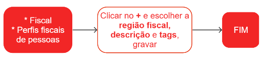

# Perfis fiscais de pessoas

Os perfis fiscais de pessoas são conjuntos de parâmetros que configuram o comportamento fiscal de uma empresa em relação às operações realizadas por ela. Esses perfis permitem que a empresa automatize diversos processos fiscais e tributários, como a emissão de notas fiscais, o cálculo de impostos, a apuração de tributos, entre outros.

Por exemplo, se uma empresa realiza a venda de produtos sujeitos à substituição tributária, ela precisa configurar seu perfil fiscal para calcular o valor do ICMS-ST (Imposto sobre Circulação de Mercadorias e Serviços - Substituição Tributária) de acordo com as regras estabelecidas pelo estado em que está localizada.

## Cadastro de um perfil fiscal da pessoa

