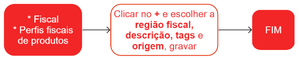

# Perfis fiscais de produtos

Os perfis fiscais de produtos são conjuntos de parâmetros que configuram o comportamento fiscal de um produto em relação às operações realizadas com ele. Esses perfis permitem que a empresa automatize diversos processos fiscais e tributários, como a emissão de notas fiscais, o cálculo de impostos, a apuração de tributos, entre outros.

Cada produto tem suas próprias particularidades, como classificação fiscal, alíquotas de impostos aplicáveis, benefícios fiscais, entre outros. Por isso, os perfis fiscais precisam ser configurados de acordo com as particularidades de cada produto.
No perfil fiscal de produto, informamos as características fiscais do produto que serão utilizadas na automação da tributação.

## Cadastro de um perfil fiscal da pessoa

