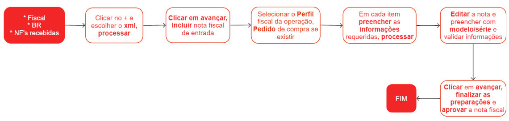

# Notas fiscais de entrada

A Nota Fiscal de Entrada é um documento fiscal utilizado para registrar a compra de mercadorias ou serviços por uma empresa de outra empresa, pessoa física ou órgão público. Ela é emitida pelo fornecedor e tem como objetivo comprovar a entrada de mercadorias ou a contratação de serviços para fins fiscais e tributários.

A Nota Fiscal de Entrada contém informações importantes, como o nome ou razão social do emitente e do destinatário, endereço, descrição e quantidade das mercadorias ou serviços adquiridos, valores unitários e totais, impostos incidentes, e outras informações relevantes.

## Escrituração manual de nota fiscal de entrada

## Escrituração manual de nota fiscal de entrada à partir de um romaneio de entrada

## Escrituração de nota fiscal de entrada à partir do XML

## Escrituração de nota fiscal de entrada de importação pela DI

## Observações do processo de escrituração de nota fiscal de importação à partir de uma DI

1. O valor do ICMS é o campo validador para verificar se os valores foram preenchidos corretamente. Se o valor conferir com a Declaração de Importação (DI), significa que tudo foi preenchido corretamente.
1. Se você não tiver todas as informações necessárias para concluir o processo, clique em "rascunho". Isso gerará automaticamente um arquivo com todas as informações já inseridas. Quando retomar o preenchimento do processo, insira o arquivo de rascunho e continue o preenchimento.
1. Caso tenha dúvidas, consulte uma Nota Fiscal já escriturada, pois servirá como base para o preenchimento correto.