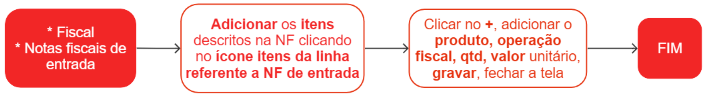

# Itens de notas fiscais de entrada

As notas fiscais são compostas por um ou mais itens, que estão descritos em linhas na nota fiscal. Cada linha contém informações detalhadas sobre o item, como a descrição, NCM (Nomenclatura Comum do Mercosul), CST (Código de Situação Tributária), CFOP (Código Fiscal de Operações e Prestações), unidade de medida, quantidade, valor unitário, valor total e impostos incidentes.

## Cadastro de itens em uma nota fiscal

