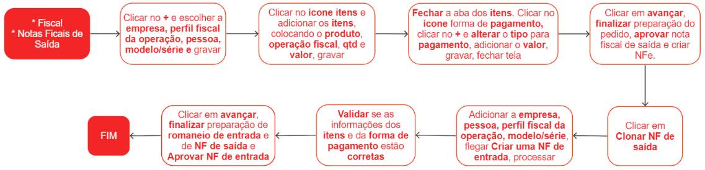
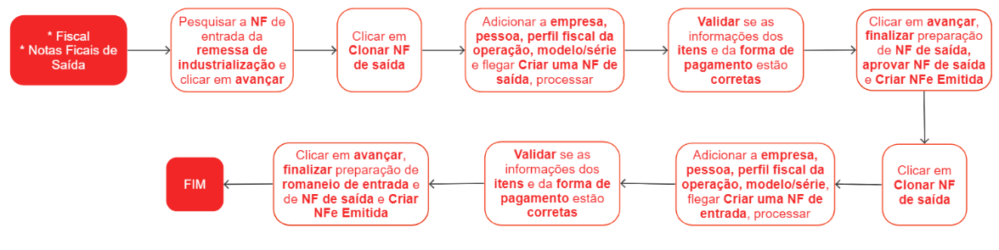
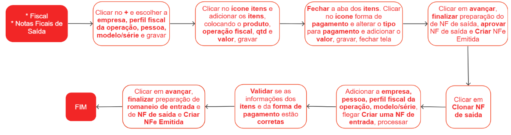

# Notas fiscais de industrialização

A nota fiscal de industrialização é um documento fiscal utilizado para registrar a saída de mercadorias de um estabelecimento para serem submetidas a processos de industrialização. Essa nota fiscal é emitida quando uma empresa envia suas mercadorias para serem transformadas, beneficiadas ou modificadas por outra empresa, denominada industrializadora.

A nota fiscal de industrialização tem como objetivo registrar e comprovar essa operação de envio das mercadorias para a industrialização, permitindo o controle fiscal e o registro adequado das atividades. Ela contém informações como dados do remetente (empresa que envia as mercadorias para a industrialização) e do destinatário (empresa que realiza a industrialização), descrição dos produtos, quantidades, valores, entre outras informações relevantes.

A emissão da nota fiscal de industrialização é importante tanto para o remetente quanto para o destinatário. Para o remetente, essa nota fiscal comprova a saída das mercadorias e é utilizada para fins de controle fiscal e contábil. Já para o destinatário, a nota fiscal de industrialização é fundamental para comprovar a entrada das mercadorias em seu estabelecimento e para posterior emissão de outras notas fiscais, como a nota fiscal de venda dos produtos industrializados.

## Processo completo de saída e entrada de itens para industrialização entre filiais

1º Passo - Emissão e escrituração de nota fiscal de remessa para industrialização

2º Passo - Emissão e escrituração de nota fiscal de retorno para industrialização

3º Passo - Emissão e escrituração de nota fiscal de cobrança de industrialização

## Pontos Relevantes

1. É de extrema importância cadastrar as CFOP's corretas nas **Regras Tributárias**, para evitar problemas futuros com o Fisco.
1. Para as operações de industrialização realizadas dentro do estado, as CFOPs correspondentes serão:
   Remessa 5.901 / 1.901
   Retorno 5.902 / 1.902
   Cobraça 5.124 / 1.124
1. Para as operações de industrialização realizadas fora do estado, as CFOPs correspondentes serão:
   Remessa 6.901 / 2.901
   Retorno 6.902 / 2.902
   Cobraça 6.124 / 2.124
1. Para obter mais informações sobre questões fiscais, é recomendável consultar a contabilidade responsável.

## Processo completo de saída e entrada de itens para industrialização entre empresa e fornecedor

1º Passo - Emissão e escrituração de nota fiscal de remessa para industrialização

2º Passo - Emissão e escrituração de nota fiscal de retorno para industrialização

3º Passo - Emissão e escrituração de nota fiscal de cobrança de industrialização

