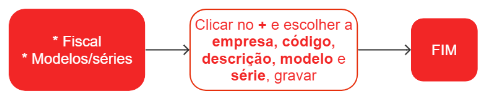

# Modelos/séries

Os modelos de série de nota fiscal são padrões numéricos utilizados para identificar uma série específica de notas fiscais emitidas por uma empresa. Cada série de nota fiscal é composta por um conjunto de notas fiscais emitidas em sequência e é identificada por um número de série único.

No Brasil, a Secretaria da Fazenda Estadual (SEFAZ) é responsável por definir os modelos de série de nota fiscal que as empresas devem utilizar em suas transações comerciais.

## Cadastro de Modelo/série

