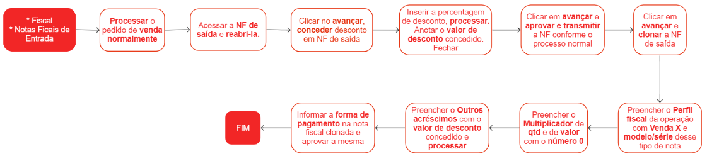

# Concessão de desconto em nota fiscal de saída

A concessão de desconto em uma Nota Fiscal de Saída é um acordo estabelecido entre a empresa e seu cliente. No entanto, é essencial que esse processo seja conduzido com cautela.

## Pontos relevantes

1. Antes de conceder o desconto, verifique se a nota fiscal está com status **aprovada** ou **preparada**. Caso isso ocorra, é necessário reverter o status para **preparando**;
1. É imprescindível anotar o valor do desconto concedido, pois essa informação será utilizada posteriormente na clonagem da nota fiscal, garantindo a precisão do valor a ser cobrado;
1. Destaca-se que a concessão de desconto é considerada como um desconto incondicional, ou seja, não está sujeita a qualquer outra condição específica para sua aplicação.

## Processo de deconto em nota fiscal de saída

