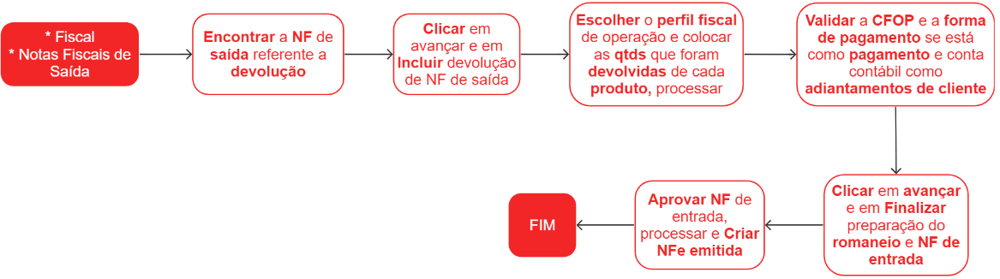
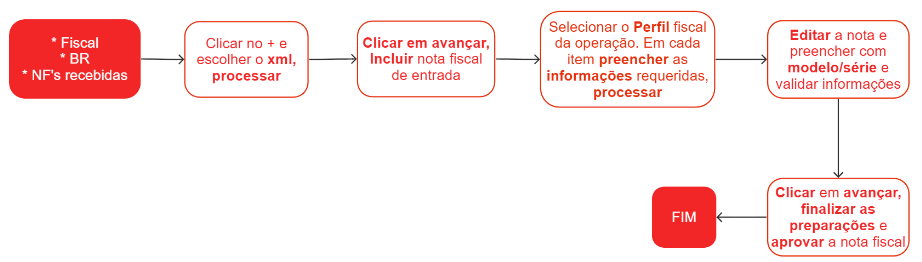

# Nota fiscal de devolução de cliente 

Uma nota de devolução de cliente é um documento utilizado para registrar a devolução de produtos por parte de um cliente. Essa nota é emitida quando o cliente solicita o retorno dos itens adquiridos, seja devido a defeitos, insatisfação ou outros motivos.

## Escrituração de nota fiscal de devolução de cliente

## Escrituração de nota fiscal de devolução de cliente por xml

