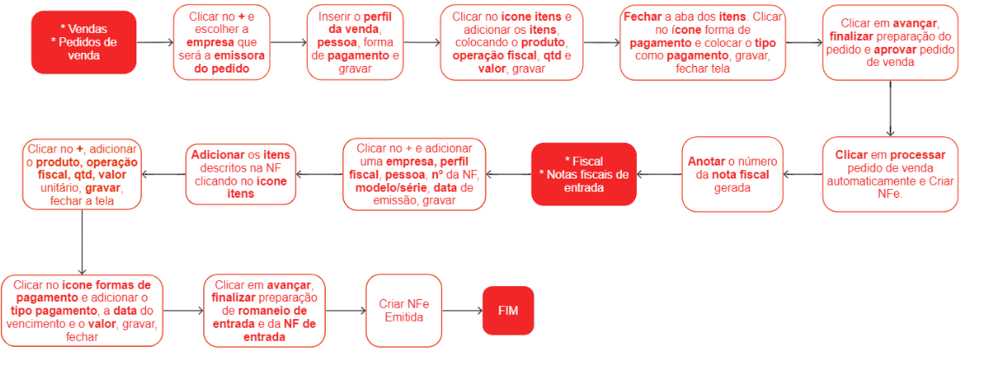
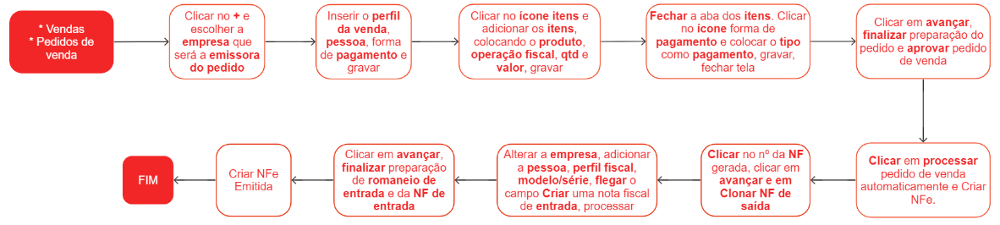

# Notas fiscais de Transferência

Uma nota fiscal de transferência é um documento fiscal utilizado para registrar a transferência de mercadorias entre estabelecimentos de uma mesma empresa ou entre empresas distintas. Esse tipo de nota fiscal é utilizado quando não há uma venda efetiva da mercadoria, mas sim uma transferência de um local para outro.

A nota fiscal de transferência tem a finalidade de documentar e comprovar essa movimentação de mercadorias, permitindo o controle fiscal e o registro adequado das operações. Ela contém informações como dados do remetente e do destinatário, descrição dos produtos transferidos, quantidades, valores, entre outras informações relevantes.

A utilização da nota fiscal de transferência varia de acordo com a legislação fiscal de cada país ou região. Em geral, ela é obrigatória em operações que envolvem a circulação de mercadorias entre estabelecimentos da mesma empresa, mas pode ser exigida também em outras situações, como transferências entre empresas do mesmo grupo econômico.

## Emissão e escrituração de uma nota fiscal de transfêrencia

## Emissão e escrituração de uma nota fiscal de transfêrencia por clonagem

