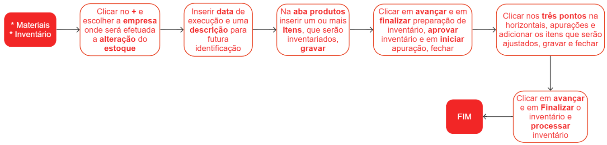

# Inventário

O inventário é um procedimento essencial no gerenciamento de estoque de uma empresa ou organização. Ele consiste em um levantamento detalhado e sistemático de todos os itens armazenados em um determinado local, como um armazém, depósito ou loja. O objetivo principal do inventário é obter uma contagem precisa e atualizada dos produtos, materiais ou ativos presentes no estoque.

## Pontos relevantes

1. Em relação à quantidade, o valor inserido deve corresponder ao valor final desejado. Por exemplo, se o estoque atual é de 100 peças e deseja-se realizar um ajuste positivo de 10 peças, o valor a ser inserido deve ser de 110.
1. Para validar o processo, é recomendado clicar nos três pontos horizontais e selecionar a opção **Diferenças**. Verifique os itens e suas quantidades que estão sendo subtraídas ou adicionadas. É importante realizar essa verificação antes de processar o inventário. Outra forma de garantir a precisão é consultar o estoque do item para verificar se a quantidade foi ajustada corretamente.

## Para fazer acertos de quantidades positivas ou negativas no estoque, siga o passo a passo abaixo:

