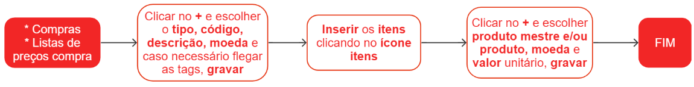
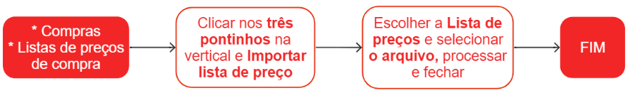

# Listas de preços de compra

A lista de preços de compra tem como objetivo estabelecer os preços a serem utilizados, simplificando o processo de criação de pedidos de compra.
Ao incluir uma lista de preços de compra no pedido, o sistema automaticamente preencherá o campo de preço do item com o valor previamente cadastrado nessa lista.

## Pontos relevantes

1. Variação mínima (%) - Define a variação mínima permitida no valor unitário do pedido de compra.
   Variação máxima (%) - Define a variação máxima permitida no valor unitário do pedido de compra.
1. E para não permitir nenhuma variação, informe 0 (zero).

## Cadastro de uma lista e itens

## Cadastro de itens por planilha em uma lista de preço existente

Planilha [LP](priceListOpImport.csv) para execução do processo.

## Manutenção da lista de preço e dos itens

Lista de preço - Localize a lista desejada e clique no ícone {.icon}. E realize as alterações necessárias.

Itens da lista - Para modificar os itens presentes em uma lista de preços, localize a lista em que o item está inserido e clique no ícone {.icon}. Em seguida, localize o item que deseja modificar e clique no ícone  {.icon}. E realize as alterações necessárias.

## Veja também

[Itens de listas de preços de compra](priceListItem)

[Importação de itens de lista de preço através de planilha](/commercial/priceListOpImport)

