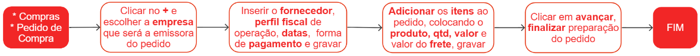

# Pedidos de compra

Um pedido de compra é um documento formal que estabelece o compromisso de um fornecedor em atender uma solicitação de material, fornecendo informações detalhadas sobre os produtos, quantidades, preços, prazos e condições de pagamento acordados.

## Pontos relevantes:

1. Um pedido de compra poderá ser excluído ou alterado somente se estiver no status Preparando;
1. Após a preparação, todo pedido deve receber a aprovação do preparo e da finalização;
1. É possível reverter a aprovação/preparação de um pedido caso não tenha romaneio associado;
1. O pedido de compra poder ser incluído manualmente ou pode ser gerado a partir de uma proposta de orçamento;

## Cadastro de um pedido de compra

## Veja também

[Orçamentos](quote)

[Itens de pedido de compra](purchaseItem)

[Formas de pagamento](purchasePayment)
