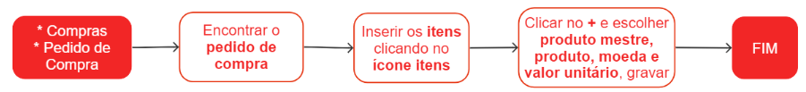

# Itens de pedidos de compra

Os itens presentes no pedido de compra são os produtos que serão adquiridos do fornecedor mediante a realização do pedido.

## Cadastro de itens no pedido de compra

## Pontos Relevantes

1. É possível realizar alterações ou exclusões em um item de pedido de compra somente quando o pedido estiver no status de preparação;
1. Caso necessário consultar as informações sobre tributações/impostos relacionados ao item, clique em {.icon}. As informações tributárias são definidas no cadastro de [regras tributárias](/taxation/taxationRule);
1. Se o campo **perfil fiscal do produto** não for preenchido, significa que o produto não tem um perfil fiscal informado no cadastro. É necessário ajustar o cadastro do produto para que o sistema possa fazer a tributação correta do item do pedido de compra;
1. Cada item possui uma unidade padrão definida em seu cadastro de produto. Caso o fornecedor envie o item em uma unidade diferente, é importante informar a unidade utilizada pelo fornecedor.

## Veja também

[Pedidos de compra](purchase)

[Regras tributárias](/taxation/taxationRule)