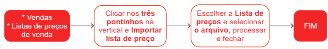

# Listas de preços de venda

Uma lista de preços de venda é um documento que contém informações detalhadas sobre os preços dos produtos ou serviços oferecidos por uma empresa. Essa lista é utilizada como referência pela equipe de vendas, fornecendo dados específicos sobre os valores de cada item ou serviço disponível.

Ao incluir a lista de preços de venda no pedido de venda, o sistema automaticamente utiliza o preço cadastrado na lista para o respectivo item do pedido. Isso garante que o valor correto seja aplicado, proporcionando maior precisão e agilidade no processo de vendas.

## Cadastro de uma lista de preço de venda

## Cadastro de itens por planilha em uma lista de preço existente

Planilha [LP](priceListOpImport.csv) para execução do processo.

## Manutenção da lista de preço e dos itens    

Lista de preço - Localize a lista desejada e clique no ícone {.icon}. E realize as alterações necessárias.

Itens da lista - Localize a lista de preços em que o item está inserido e clique no ícone {.icon}. Em seguida, localize o item que deseja modificar e clique no ícone  {.icon}. E realize as alterações necessárias.

## Pontos relevantes

1. A exclusão de uma lista de preços é um processo irreversível e só é possível se ela não tiver sido utilizada em nenhum pedido de venda.

## Veja também

[Itens de listas de preços de venda](priceListItem)

[Importação de itens de lista de preço através de planilha](/commercial/priceListOpImport)

