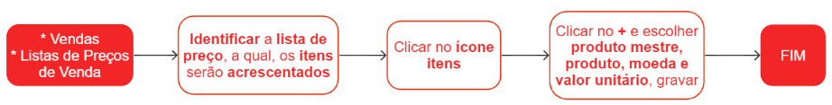

# Itens de listas de preços de venda

Uma lista de vendas consiste em uma seleção de itens que são previamente determinados e organizados para facilitar o processo de venda. Os itens podem ser cadastrados tanto por meio do produto mestre quanto diretamente pelos produtos individuais. Ao utilizar o produto mestre, todos os produtos associados a ele adotarão o mesmo preço.

## Cadastro de um item na lista de preço de venda

## Cadastro de itens na lista através de uma planilha

## Manutenção dos itens na lista de venda

Para modificar os itens presentes em uma lista de preços, localize a lista em que o item está inserido e clique no ícone {.icon}. Em seguida, localize o item que deseja modificar e clique no ícone  {.icon}. E realize as alterações necessárias.

## Veja também     

[Listas de preço de venda](priceList)

[Importação de itens de lista de preço através de planilha](/commercial/priceListOpImport)