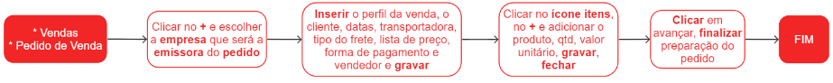

# Pedidos de venda

Um pedido de venda é um documento que formaliza o compromisso de um cliente em adquirir um material, detalhando os produtos, quantidades, preços e condições de prazo e pagamento acordados.

## Pontos relevantes:

1. Um pedido de venda poderá ser excluído ou alterado se estiver no status Preparando;
1. Após a preparação,  é necessário obter a aprovação tanto do preparo quanto da finalização do pedido;
1. Caso não haja romaneio associado, é possível reverter a aprovação/preparação de um pedido;
1. É possível distribuir os valores de frete, seguro ou outras despesas entre os itens do pedido. Para fazer isso, localize o pedido de venda desejado, clique em **Avançar** e selecione a opção **Ratear valores entre os itens**. Em seguida, siga as instruções fornecidas aqui.
1. A opção **Processar pedido de venda automaticamente** realiza a baixa do estoque e gera a nota fiscal de saída. Essa ação está disponível nas opções ao clicar em **avançar**.

## Cadastro de um pedido de venda

## Veja também

[Item de pedido de venda](saleItem)

[Tela facilitadora para incluir item de pedido de venda](saleItemOpCreate)

[Formas de pagamento](salePayment)

[Notas fiscais de saída](/fiscal/outgoingInvoice/outgoingInvoice)