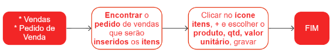

# Item de pedido de venda

Os itens presentes no pedido de venda são os produtos que serão adquiridos pelo cliente mediante a realização do pedido.

## Pontos Relevantes

1. É possível realizar alterações ou exclusões em um item de pedido de venda somente quando o pedido estiver no status de preparação;
1. Caso necessário consultar as informações sobre tributações/impostos relacionados ao item, clique em {.icon}. As informações tributárias são definidas no cadastro de [regras tributárias](/taxation/taxationRule);
1. Se o campo **perfil fiscal do produto** não for preenchido, significa que o produto não tem um perfil fiscal informado no cadastro. É necessário ajustar o cadastro do produto para que o sistema possa fazer a tributação correta do item do pedido de venda.

## Cadastro de itens no pedido de venda

## Veja também

[Pedidos de venda](sale)

[Tela facilitadora para incluir item de pedido de venda](saleItemOpCreate)

[Listas de preços de venda](priceList)

[Regras tributárias](/taxation/taxationRule)
