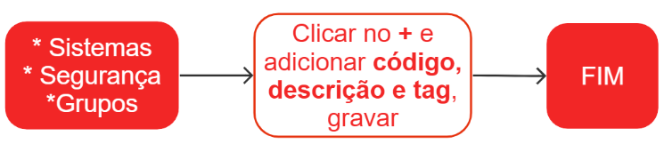

# Grupos de acesso

O recurso de grupos de acesso oferece uma maneira conveniente e eficiente de liberar o uso dos módulos do sistema para novos usuários ou adicionar permissões a usuários existentes. Ao associar um usuário ou equipe a um grupo, todas as permissões de acesso são automaticamente configuradas para esse ponto de acesso específico. Isso simplifica o processo de gerenciamento de permissões, garantindo que os usuários tenham acesso adequado às funcionalidades necessárias.

## Cadastro de um grupo

Exemplo:
Campo Código - /zensoft/fiscal
Campo Descrição - Zensoft, Fiscal